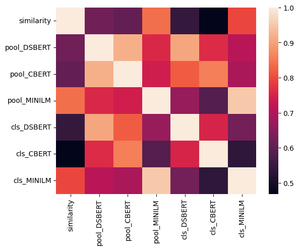
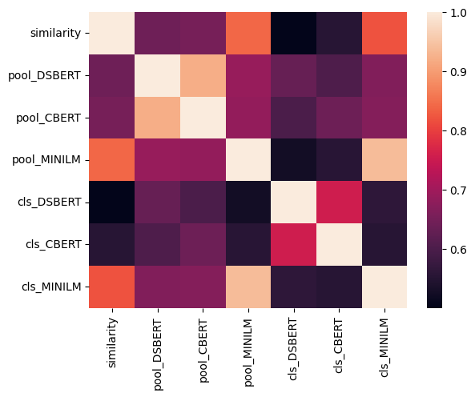
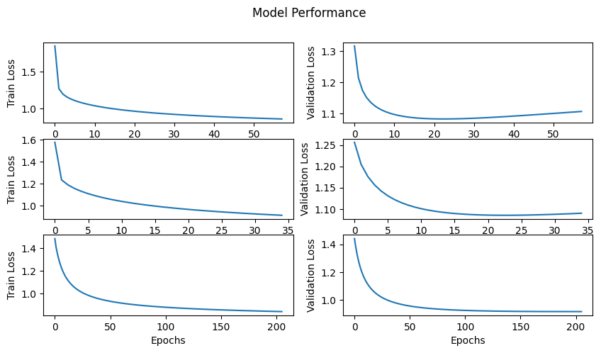

# Sentence Similarity
## Goal: 
To test models trained on clinical text on general sentence similarity tasks 
## Models: 
Results of models on NER and NLI tasks : https://arxiv.org/pdf/1904.03323.pdf

Bio_DSBERT : https://huggingface.co/emilyalsentzer/Bio_Discharge_Summary_BERT
Bio_ClinicalBERT : https://huggingface.co/emilyalsentzer/Bio_Discharge_Summary_BERT

Results of models tested on ClinicalSTS : https://www.ncbi.nlm.nih.gov/pmc/articles/PMC8190645/

Textual similarity dataset : https://www.kaggle.com/datasets/kanhataak/task-finding-semantic-textual-similarity
                             https://github.com/brmson/dataset-sts/tree/master/data/sts/sick2014 (Domain irrelevant similarity)
Symptom similarity dataset : https://www.kaggle.com/datasets/niyarrbarman/symptom2disease

## Tasks: Test models on STS task and Symptom similarity
### Cosine Similarity on SICK dataset:

### Cosine Similarity on Biosses dataset

### Pearson Correlation

| Method_Model | SICK | BIOSSES |
| ----------- | ----------- | ----------- |
| Pool_DSBERT | 0.6212 | 0.6435 |
| Pool_CBERT | 0.6045 | 0.6520 |
| Pool_MINILM | 0.8391 | 0.8413 |
| cls_DSBERT | 0.5420 | 0.5013 |
| cls_CBERT | 0.4683 | 0.5529 |
| cls_MINILM | 0.7958 |   0.8199 |

---

 `Top`: [DSBERT]() 
 `Middle`: [CBERT]() 
 `Bottom`: [MINILM]() 

### Model + Dense Layer trained on SICK data

| Model | Dev Pearson | Test Pearson | Test Spearman |
| ----------- | ----------- | ----------- | ----------- |
| MINILM | 0.8825 | 0.8668 | 0.8003 |
| DSBERT | 0.7602 | 0.7650 | 0.7046 |
| CBERT | 0.7700 | 0.7702 | 0.7029 |

### Model + Dense Layer tested on BIOSSES data

| Model | Pearson | Spearman |
| ----------- | ----------- | ----------- |
| MINILM | 0.7821 | 0.7765 |
| DSBERT | 0.4346 | 0.4064 |
| CBERT | 0.5409 | 0.5439 |

